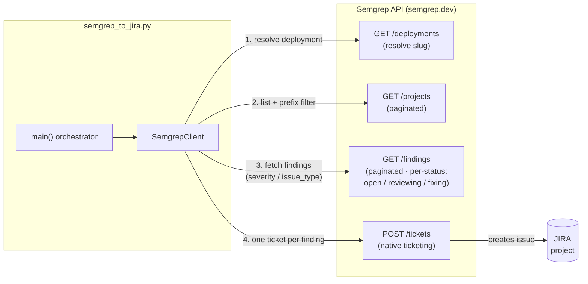
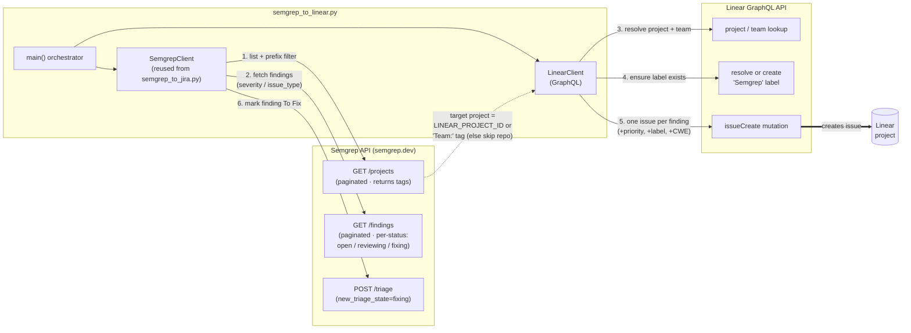

# Semgrep → JIRA / Linear Ticket Automation

This project contains Python scripts that automatically create issues from **Semgrep findings** for a subset of repositories inside a Semgrep deployment:

- **`semgrep_to_jira.py`** — creates JIRA tickets via Semgrep's native Tickets API.
- **`semgrep_to_linear.py`** — reuses the Semgrep finding-gathering logic and creates issues in a **Linear** project via the Linear GraphQL API.

---

## `semgrep_to_jira.py` (Semgrep → JIRA)

This script automatically creates JIRA tickets from **Semgrep findings** for a subset of repositories inside a Semgrep deployment.

The script performs the following workflow:

1. Retrieves all projects from a Semgrep deployment.
2. Filters only projects whose name starts with a specific prefix (e.g. `sebasrevuelta/`).
3. Retrieves findings for each filtered project, filtered by severity and issue type via the API.
4. Creates one JIRA ticket per finding through the Semgrep Tickets API.

### Architecture



---

## Requirements

- Python **3.9+**
- `pip`
- A Semgrep API token
- Access to the Semgrep deployment APIs

### Python Dependencies

```bash
pip install requests
```

---

## Environment Variables

| Variable | Required | Description |
|----------|----------|-------------|
| `SEMGREP_TOKEN` | Yes | Semgrep API token |
| `DEPLOYMENT_SLUG` | Yes | Your Semgrep deployment slug |
| `JIRA_PROJECT_ID` | No | JIRA project ID where tickets will be created (string or integer). If omitted, payload is sent without this field |
| `PROJECT_PREFIX` | Yes | Repository name prefix filter, e.g. `myorg/` |
| `SEMGREP_BASE_URL` | No | Defaults to `https://semgrep.dev` |
| `SEMGREP_REQUEST_TIMEOUT_S` | No | Request timeout in seconds (default: `30`) |
| `SEMGREP_MAX_RETRIES` | No | Max retries for timeout/network and retryable HTTP errors (default: `5`) |
| `SEMGREP_RETRY_SLEEP_S` | No | Base retry sleep in seconds used for incremental backoff (default: `2`) |
| `SEMGREP_MAX_BACKOFF_S` | No | Max backoff cap in seconds (default: `30`) |

Example:

```bash
export SEMGREP_TOKEN="xxxxx"
export DEPLOYMENT_SLUG="my-deployment"
export JIRA_PROJECT_ID="12345"
export PROJECT_PREFIX="myorg/"
export SEMGREP_REQUEST_TIMEOUT_S="60"
export SEMGREP_MAX_RETRIES="8"
```

---

---

## Running the Script

All arguments are optional. By default the script runs in dry-run mode with `sast` issue type.

```bash
# Dry run (default) — no tickets are created
python semgrep_to_jira.py

# Create tickets for SAST critical findings
python semgrep_to_jira.py --no-dry-run --issue-type sast --severities critical

# Create tickets for SCA high and critical findings on a single repo
python semgrep_to_jira.py --no-dry-run --issue-type sca --severities high critical --repo sebasrevuelta/MyRepo

# Override deployment slug from the command line
python semgrep_to_jira.py --no-dry-run --deployment my-other-deployment --issue-type sast
```

### Arguments

| Argument | Required | Default | Description |
|----------|----------|---------|-------------|
| `--deployment` | No | `DEPLOYMENT_SLUG` env var | Semgrep deployment slug. Overrides the env var when provided |
| `--issue-type` | No | `sast` | Issue type to filter and ticket: `sast` or `sca` |
| `--severities` | No | `critical` | Severity levels to fetch. Multiple values accepted |
| `--dry-run` | No | `True` | Log actions without creating tickets (default behaviour) |
| `--no-dry-run` | No | — | Disable dry run and actually create tickets |
| `--repo` | No | — | Process a single repo instead of all prefix-matching projects |

---

## Dry Run Mode

Dry run is **enabled by default**. Pass `--no-dry-run` to actually create tickets:

```bash
# Safe — only logs what would happen
python semgrep_to_jira.py

# Live — creates tickets
python semgrep_to_jira.py --no-dry-run
```

---

## Ticket Creation Logic

One ticket is created per finding when:

- The finding matches the requested `--issue-type` and `--severities` (filtered by the API)
- The finding's status is one of `open`, `reviewing`, or `fixing` (the findings API is queried once per status and results are merged/de-duped, since it accepts a single status per request)
- The finding has a valid issue ID
- The repository matches the prefix filter
- The issue ID has not already been ticketed in the current run (in-memory de-dupe)

> Both project listing and findings retrieval are fully paginated (zero-based `page`/`page_size`), so large deployments do not silently omit repositories or findings.

### POST payload fields

| Field | Value |
|-------|-------|
| `issue_type` | Value of `--issue-type` (`sast` or `sca`) |
| `issue_ids` | Single-element list with the finding's ID |
| `jira_project_id` | Value of `JIRA_PROJECT_ID` env var |

---

## API Endpoints Used

### List Projects
```
GET /api/v1/deployments/{deploymentSlug}/projects
```

### List Findings
```
GET /api/v1/deployments/{deploymentSlug}/findings?repos=<repo>&severities=<sev>&issue_type=<type>
```

### Create Ticket
```
POST /api/v1/deployments/{deploymentSlug}/tickets
```

---

## Common Pitfalls

| Problem | Cause |
|---------|-------|
| No tickets created | No findings match the given severity / issue type |
| API errors | Invalid token or deployment slug |
| Missing tickets | `DRY_RUN` is set to `True` |

---

## Summary

This automation bridges Semgrep security findings with JIRA workflows by:

- Filtering repositories by prefix.
- Fetching findings filtered by severity and issue type.
- Creating one structured ticket per finding automatically.

It reduces manual triage effort while maintaining control and accuracy.

---

# `semgrep_to_linear.py` (Semgrep → Linear)

This script **reuses the Semgrep finding-gathering logic** from `semgrep_to_jira.py`
(it imports it as a module) and then, as a second step, creates one **Linear**
issue per finding in a configured Linear project.

Unlike the JIRA variant — which delegates ticket creation to Semgrep's native
`POST /tickets` endpoint — Linear is not a native Semgrep ticketing target, so
this script builds each issue itself and talks to the **Linear GraphQL API**
(`issueCreate` mutation) directly.

The workflow:

1. Resolves the Semgrep deployment automatically via `GET /api/v1/deployments` (or uses `DEPLOYMENT_SLUG` if set).
2. Retrieves all projects from that deployment.
3. Filters projects whose name starts with `PROJECT_PREFIX` (or keeps all projects when it is unset).
4. Retrieves findings for each filtered project, filtered by severity and issue type.
5. Creates one Linear issue per finding in the target Linear project — `LINEAR_PROJECT_ID` if set, otherwise the project named in the Semgrep project's `Team:` tag (repos without a tag are skipped).
6. Marks each ticketed finding as **To Fix** (`fixing`) back in Semgrep.

### Architecture



> ⚠️ **Data handling:** this script transmits Semgrep findings (scan output) to
> Linear. Confirm Linear is an approved integration for your organization before
> running live (`--no-dry-run`) against real findings.

## Requirements

Same as the JIRA script (Python 3.9+, `pip install requests`, a Semgrep API
token), plus a **Linear API key** and access to the target Linear project.

## Environment Variables

The Semgrep-side variables (`SEMGREP_TOKEN`, `DEPLOYMENT_SLUG`, `PROJECT_PREFIX`,
`SEMGREP_BASE_URL`, and all the retry/timeout `SEMGREP_*` variables) are shared
with `semgrep_to_jira.py` and behave identically. `JIRA_PROJECT_ID` is **not**
used by the Linear script.

The deployment is resolved automatically from `GET /api/v1/deployments`, so
`DEPLOYMENT_SLUG` is **optional** — set it only to pin a specific deployment
when the token can access more than one.

| Variable | Required | Description |
|----------|----------|-------------|
| `SEMGREP_TOKEN` | Yes | Semgrep API token |
| `PROJECT_PREFIX` | No | Repository name prefix filter, e.g. `myorg/`. When unset, **all** projects in the deployment are processed |
| `DEPLOYMENT_SLUG` | No | Semgrep deployment slug. Auto-discovered from `/api/v1/deployments` when unset |
| `LINEAR_API_KEY` | Yes | Linear API key (personal API key or OAuth token) |
| `LINEAR_PROJECT_ID` | No | Linear project reference where issues are created. Accepts the project UUID **or** the URL slug id (e.g. `sebas-90890a2b68fc`); it is resolved to the canonical UUID. **When unset**, the target Linear project is derived per repo from the Semgrep project tag starting with `Team:` (e.g. `Team: sebas-90890a2b68fc`). A repo with no such tag **and** no `LINEAR_PROJECT_ID` is skipped (no issue created) |
| `LINEAR_TEAM_ID` | No | Linear team ID. If omitted, the team is resolved from the Linear project (first team it belongs to) |
| `LINEAR_API_URL` | No | Defaults to `https://api.linear.app/graphql` |

Example:

```bash
export SEMGREP_TOKEN="xxxxx"
export PROJECT_PREFIX="myorg/"
export LINEAR_API_KEY="lin_api_xxxxx"
export LINEAR_PROJECT_ID="a1b2c3d4-...."
# Optional — pin a specific deployment (otherwise auto-discovered):
export DEPLOYMENT_SLUG="my-deployment"
# Optional — otherwise derived from the Linear project:
export LINEAR_TEAM_ID="e5f6g7h8-...."
```

## Running the Script

By default it runs in dry-run mode with the `sast` issue type.

```bash
# Dry run (default) — no Linear issues are created
python semgrep_to_linear.py

# Create Linear issues for SAST critical findings
python semgrep_to_linear.py --no-dry-run --issue-type sast --severities critical

# Create issues for SCA high and critical findings on a single repo
python semgrep_to_linear.py --no-dry-run --issue-type sca --severities high critical --repo sebasrevuelta/MyRepo
```

### Arguments

| Argument | Required | Default | Description |
|----------|----------|---------|-------------|
| `--issue-type` | No | `sast` | Issue type to filter: `sast`, `sca` or `ai_sast` |
| `--severities` | No | `critical` | Severity levels to fetch. Multiple values accepted |
| `--dry-run` | No | `True` | Log actions without creating issues (default behaviour) |
| `--no-dry-run` | No | — | Disable dry run and actually create Linear issues |
| `--repo` | No | — | Process a single repo instead of all prefix-matching projects |

## Linear Issue Content

Each finding becomes one Linear issue:

- **Title:** `[<Severity>] <Readable Rule Name> — <path>:<line>` (e.g. `[High] Compile Taint Grpc — Dashboard2.cs:71`) — the readable name is the last segment of the rule id with dashes replaced by spaces and title-cased (e.g. `...active-debug-code-getstacktrace` → `Active Debug Code Getstacktrace`).
- **Description:** finding ID, rule (linked to the rule on the Semgrep registry, `<SEMGREP_BASE_URL>/r?q=<rule_name>`), severity, **confidence** of the Semgrep rule, issue type (`sast`/`sca`/`ai_sast`), repository, **CWE identifier(s)** from the rule (`rule.cweNames`, when available), **created-at** timestamp (when available), location (linked to the source line), rule message, **how-to-fix guidance from Semgrep Assistant** (from the finding's `assistant.guidance`, when available), a **View the code** link to the source line (when available), and a **View in Semgrep** link to the finding's details page (`<SEMGREP_BASE_URL>/orgs/<deployment>/findings/<finding_id>`).
- **Priority:** mapped from Semgrep severity — `critical → Urgent`, `high → High`, `medium → Medium`, `low → Low`, `info → No priority`.
- **Label:** every created issue is tagged with the `Semgrep` label. The label is looked up by name and created (team-scoped) if it does not exist. Label resolution/creation is skipped in dry-run mode.
- **Semgrep status:** after a Linear issue is created (non-dry-run only), the finding is marked **To Fix** in Semgrep via the bulk triage API (`POST /api/v1/deployments/<deployment>/triage` with `new_triage_state=fixing`). A triage failure is logged as a warning and does not fail the run.

## Duplicate Prevention

- **In-run de-dupe:** each finding ID is filed at most once per run (same as the JIRA script).
- **Across runs (idempotency):** a `[Semgrep #<id>]` marker is embedded in the issue **description** (a footer line). Before creating, the target Linear project is searched for an issue whose description contains that marker; matching issues are skipped. This makes re-runs safe. (The marker moved from the title to the description when the title switched to a severity prefix.)

## API Used

### Resolve deployment (when `DEPLOYMENT_SLUG` is not set)
```
GET /api/v1/deployments
```

### Resolve team from project (when `LINEAR_TEAM_ID` is not set)
```graphql
query { project(id: $id) { teams(first: 1) { nodes { id } } } }
```

### Duplicate check
```graphql
query { issues(filter: { project: { id: { eq: $id } }, description: { contains: $marker } }, first: 1) { nodes { id } } }
```

### Create issue
```graphql
mutation { issueCreate(input: { teamId, projectId, title, description, priority }) { success issue { id identifier url } } }
```
